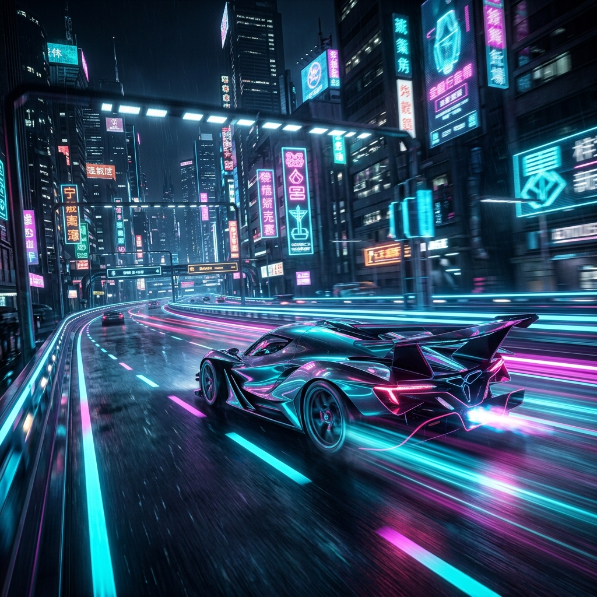

# 🏎️ VELOCITY X — Neon Highway



**VELOCITY X** is a high-octane, synthwave-inspired arcade racing game built with pure vanilla technology. Navigate through a relentless neon highway, dodge high-speed traffic, manage your fuel reserves, and push your limits in a world where speed is everything.

---

## ✨ Features

- **🕹️ Dual Game Modes**: 
    - **Endless**: Test your endurance and reflexes on an infinite track.
    - **Overdrive (Daily)**: A high-intensity mode designed for daily challenges.
- **🏆 Global Leaderboards**: Compete with players worldwide for the top spot. Integrated callsign system saves your progress locally.
- **🎵 Procedural Audio Engine**: 100% synthesized sound using the **Web Audio API**. No external audio files—just pure, real-time math-generated engine roars, wind noise, and cinematic impacts.
- **📱 PWA Ready**: Fully installable on mobile and desktop. Play offline with seamless Service Worker caching.
- **⚡ Cinematic Experience**: Features a high-fidelity intro sequence, dynamic zoom effects, and a premium "neon-throb" UI.
- **🎮 Responsive Controls**: Optimized for both keyboard (Desktop) and a custom-built virtual D-pad (Mobile).

---

## 🛠️ Tech Stack

This project is a masterclass in modern vanilla web development:

- **Core**: HTML5, CSS3, ES6+ JavaScript.
- **Graphics**: 2D Canvas API with pixel-perfect rendering and dynamic lighting effects.
- **Audio**: Web Audio API (Subtractive Synthesis, LFOs, Biquad Filters).
- **Persistence**: LocalStorage for scores and player settings.
- **Offline**: Service Workers & Web App Manifest (PWA).

---

## 🎮 How to Play

### Controls

| Action | Desktop (Keyboard) | Mobile (D-Pad) |
| :--- | :--- | :--- |
| **Move Left / Right** | `◀` / `▶` Arrows | `◀` / `▶` Buttons |
| **Boost Speed** | `▲` Arrow | `▲` Button |
| **Brake** | `▼` Arrow | `▼` Button |
| **Pause** | `P` or UI Button | UI Button |
| **Mute** | UI Button | UI Button |

### Mechanics

- **Fuel Management**: Your fuel depletes over time. Collect blue energy canisters to keep your engine running.
- **Combos**: Perform "Near Misses" by passing closely to traffic without crashing to multiply your score.
- **Survival**: One crash and it's game over. Use your brakes wisely in tight spots!

### Scoring Breakdown

- **Distance**: Earn points continuously based on your current speed.
- **Traffic Passed**: +12 points for every car successfully overtaken.
- **Fuel Pickups**: +20 points for fuel canisters.
- **Bonus Pickups**: +60 points for rare energy cores.
- **Combo Multiplier**: Near misses and rapid overtakes build your combo, significantly boosting your score output.

---

## 🎨 Aesthetic & Visuals

Velocity X is designed to evoke the feeling of 80s synthwave and futuristic cyberpunk.

- **Dynamic Environment**: Features a multi-layered parallax background with neon buildings and scrolling grids.
- **Weather Effects**: Real-time synthesized rain particles that react to game speed.
- **Impact Feedback**: Procedural screen shake and particle bursts for collisions and boosts.
- **Premium UI**: Uses **Glassmorphism**, **Neon Glows**, and **Orbitron** typography to create a high-tech atmosphere that feels "alive" through subtle micro-animations.

---

## 🛠️ Development & Customization

The game is designed with modular constants, making it easy to tweak the difficulty or aesthetics:

- **Difficulty**: Adjust `gameSpeed`, `trafficInterval`, and `trafficSpeed` constants in `index.html` to change the pace.
- **Physics**: Modify `LANE_W`, `NUM_LANES`, and player movement interpolation for a different "feel."
- **Audio**: The `Audio Engine` section at the top of the script contains all the synthesis parameters for the engine and effects.
- **Assets**: Simply replace the PNG files to change the hero car or background art.

---

## 🚀 Installation & Setup

No build tools or servers required. 

1.  **Clone the repository**:
    ```bash
    git clone https://github.com/your-username/velocity-x-game.git
    ```
2.  **Open the game**:
    Simply open `index.html` in any modern web browser.

For the full PWA experience (Offline Support), it is recommended to serve the folder via a local server (e.g., VS Code Live Server or `npx serve .`).

---

## 📂 Project Structure

- `index.html`: The monolithic core containing game logic, styles, and UI.
- `sw.js`: Service worker for asset caching and offline functionality.
- `manifest.json`: Web app configuration for PWA installation.
- `velocity_x_hero_*.png`: High-resolution cinematic hero art.
- `velocity_x_bg_*.png`: Dynamic parallax background assets.
- `velocity_x_icon_*.png`: High-fidelity app icon.

---

Developed with ❤️ by [Sagar Swain]
